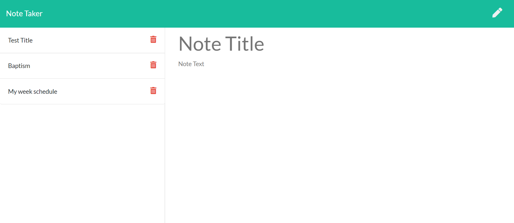

# Note_Taker

 

## Description

  The purpose of this project is to to create an application called Note Taker that can be used to write and save notes.

  ## Table of Content 

  * [Description](#descripton) 
  * [Installation](#installation) 
  * [Usage](#usage) 
  * [Guidlines](#guidlines) 
  * [Screenshots](#guidlines) 
  * [Project Links](#guidlines) 
  * [License](#license) 
  * [Contact](#contact) 
    
## Installation
    
    Install the express packages for creating the html and API routes
    
## Usage
    
    The app can save and retrieve data.

## Technologie Used

    Node.js, npm, Javascript, express, html, css, Bootstrap.
    
## Guidlines
    
    It is an open app and all contribution are welcome.

## Screenshots

## Project Links

[Heroku Deployment](https://young-river-44406.herokuapp.com/)

[Github Repository](https://github.com/AlCharl88/Note_Taker)
    
## License
    
    MIT License
    
##  Contact

    Alain Tagne - [Github](https://github.com/AlCharl88) Email: [Alain](mailto:alctagne@gmail.com) 

----

&copy; 2021 Alain Tagne

    